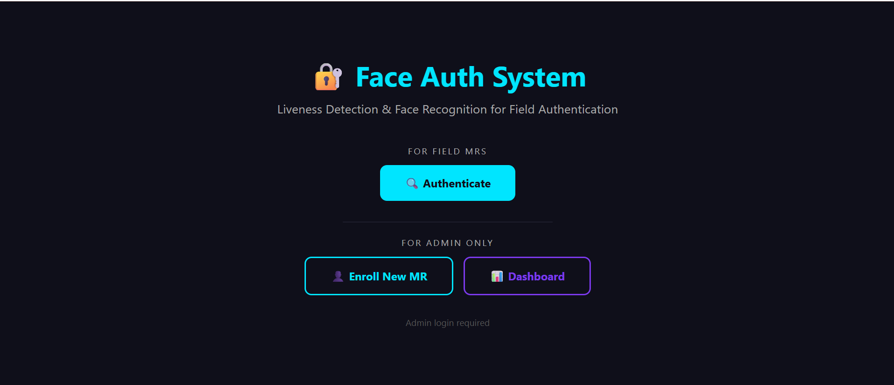
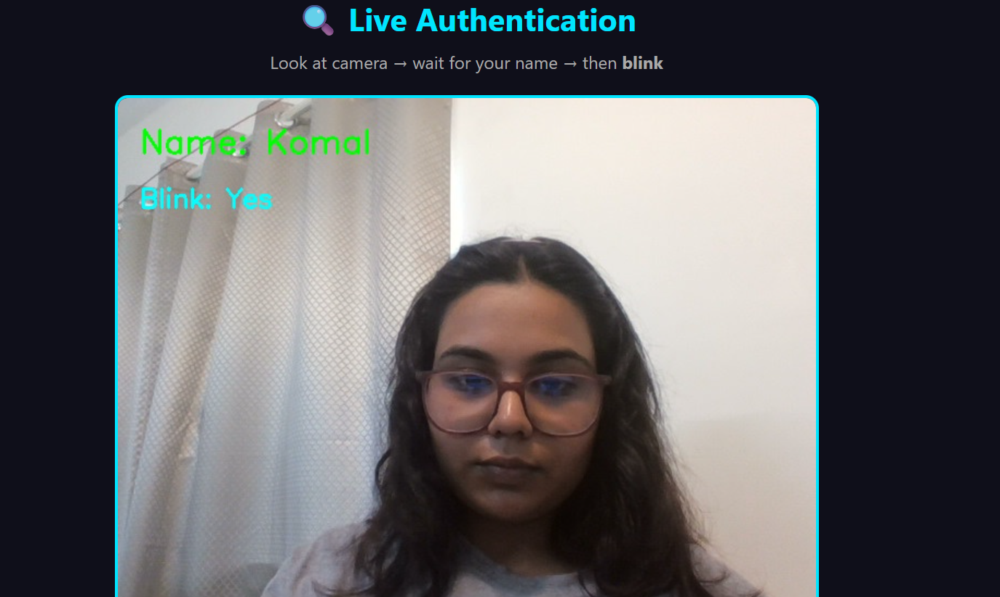
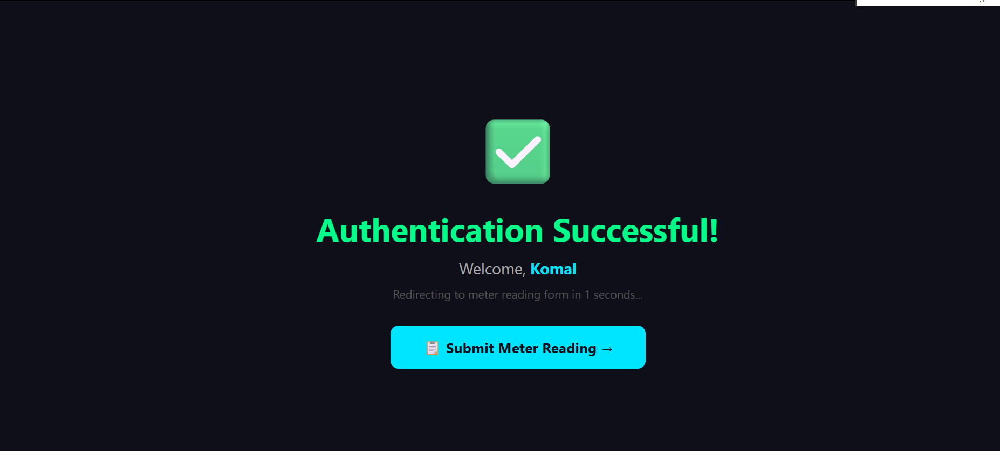

# 🔐 Face Authentication System with Liveness Detection

A real-time face recognition and liveness detection web application built for **field MR (Meter Reader) authentication**. MRs authenticate using their face + blink detection, preventing proxy attendance and photo spoofing.

---

## 📸 Demo

### Home Page



### Authentication



### Success page



### Dashboard


### Meter Reading Form


---

## ✨ Features

- ✅ **Face Recognition** — Identifies enrolled MRs using deep learning
- ✅ **Liveness Detection** — Detects real blinks to prevent photo spoofing
- ✅ **MR Enrollment** — Admin enrolls MRs with Employee ID and Region
- ✅ **GPS Location Capture** — Records MR location on authentication
- ✅ **Meter Reading Submission** — MR submits consumer readings with photo
- ✅ **Admin Dashboard** — View all authentication logs and meter readings
- ✅ **Export CSV** — Download logs and readings as spreadsheet
- ✅ **Admin Login** — Protected dashboard with session management
- ✅ **Multi-threading** — Smooth camera feed with background recognition

---

## 🏗️ System Architecture

Browser (MR/Admin)
↓
Flask Web Server (app.py)
↓
┌──────────────────────────────────┐
│ Thread 1: Camera Stream │
│ Thread 2: Face Recognition │
└──────────────────────────────────┘
↓
match.py (face_recognition + dlib)
↓
SQLite Database (logs.db)

---

## 🛠️ Tech Stack

| Layer              | Technology                        |
| ------------------ | --------------------------------- |
| Backend            | Python, Flask                     |
| Face Recognition   | face_recognition, dlib            |
| Computer Vision    | OpenCV                            |
| Liveness Detection | EAR Algorithm (dlib 68 landmarks) |
| Database           | SQLite                            |
| Frontend           | HTML, CSS, JavaScript             |
| Threading          | Python threading module           |

---

## 📁 Project Structure

face_auth_project/
├── app.py # Flask server, routes, threading
├── match.py # Face recognition & blink detection
├── requirements.txt # Python dependencies
├── dataset/ # Face photos (not uploaded)
├── static/
│ └── meter_photos/ # Uploaded meter images
└── templates/
├── index.html # Home page
├── login.html # Admin login
├── enroll.html # MR enrollment
├── authenticate.html # Live authentication
├── success.html # Auth success + redirect
├── meter_reading.html # Meter reading form
├── reading_success.html # Submission confirmation
├── dashboard.html # Auth logs dashboard
└── readings_dashboard.html # Meter readings dashboard

---

## ⚙️ Installation & Setup

### Prerequisites

- Python 3.10 (dlib requires 3.10 or lower)
- Visual Studio Build Tools (for dlib compilation on Windows)
- Webcam

### Step 1 — Clone the repository

```bash
git clone https://github.com/YOUR_USERNAME/face-auth-system.git
cd face-auth-system
```

### Step 2 — Create virtual environment

```bash
py -3.10 -m venv venv
venv\Scripts\activate       # Windows
source venv/bin/activate    # Mac/Linux
```

### Step 3 — Install dependencies

```bash
pip install -r requirements.txt
```

### Step 4 — Download dlib face landmark model

Download `shape_predictor_68_face_landmarks.dat` from:
👉 https://github.com/davisking/dlib-models

Extract and place in project root folder.

### Step 5 — Run the application

```bash
python app.py
```

Open browser: `http://127.0.0.1:5000`

---

## 🔑 Default Admin Credentials

Username: Admin
Password: Admin123

> ⚠️ Change these in `app.py` before production deployment

---

## 🚀 How It Works

### For Admin (One time setup)

1. Login with admin credentials
2. Go to **Enroll New MR**
3. Enter MR name, Employee ID, Region
4. Capture 5+ face photos via webcam
5. System trains the model automatically

### For MR (Daily use)

1. Open the app → Click **Authenticate**
2. Look at the camera
3. Blink naturally when name appears
4. Fill meter reading form
5. Submit reading with consumer details

### Anti-Spoofing (Liveness Detection)

The system uses **Eye Aspect Ratio (EAR)** algorithm to detect genuine blinks:

- Photo held to camera → EAR stays constant → Authentication fails ❌
- Real person blinks → EAR drops then rises → Authentication succeeds ✅

---

## 📊 Database Schema

### auth_logs

| Column           | Type    | Description            |
| ---------------- | ------- | ---------------------- |
| id               | INTEGER | Primary key            |
| name             | TEXT    | MR name                |
| mr_id            | TEXT    | Employee ID            |
| region           | TEXT    | MR region              |
| blink_detected   | INTEGER | 1=Yes, 0=No            |
| timestamp        | TEXT    | Date and time          |
| status           | TEXT    | SUCCESS/FAILED         |
| latitude         | TEXT    | GPS latitude           |
| longitude        | TEXT    | GPS longitude          |
| location_address | TEXT    | Human readable address |

### meter_readings

| Column           | Type    | Description        |
| ---------------- | ------- | ------------------ |
| id               | INTEGER | Primary key        |
| mr_name          | TEXT    | MR who submitted   |
| mr_id            | TEXT    | Employee ID        |
| consumer_id      | TEXT    | Consumer account   |
| consumer_name    | TEXT    | Consumer name      |
| previous_reading | REAL    | Last month reading |
| current_reading  | REAL    | This month reading |
| units_consumed   | REAL    | Difference         |
| reading_photo    | TEXT    | Photo filename     |
| timestamp        | TEXT    | Submission time    |
| location         | TEXT    | GPS coordinates    |

---

## 🔮 Future Scope

- Mobile app (React Native / Flutter)
- Cloud deployment (AWS / Azure)
- MySQL database for multi-server support
- Email/SMS alerts for failed authentications
- Monthly billing report generation
- OTP as secondary authentication factor

---

## 👩‍💻 Developer

**Komal Goel**

- Internship Project — Built as part of field force authentication system

---

## 📄 License

MIT License — feel free to use and modify
